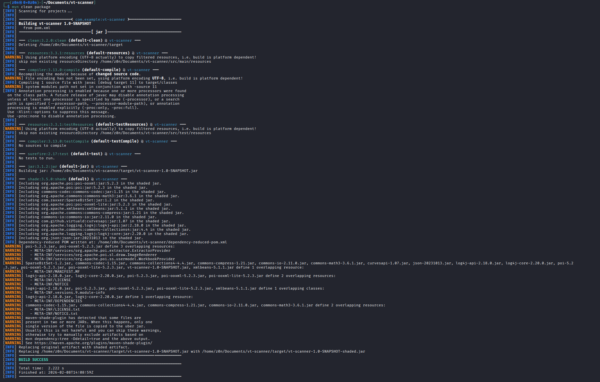

# Threat-Intel-HASH-Conversion


A Python script to bulk scan file hashes against the VirusTotal API using an input Excel file. This version is modernized to support **Python 3.13+** and **.xlsx files** by utilizing `openpyxl` instead of the deprecated `xlrd`.

###  Features

* **Bulk Processing:** Reads a column of hashes from an input `.xlsx` file.
* **API Rate Limiting:** Includes a 16-second delay between requests to comply with the VirusTotal Public API (4 requests/minute).
* **Robust Error Handling:** Handles non-existent hashes, API limit hits (204), and empty rows without crashing.
* **Data Export:** Saves MD5, SHA-1, SHA-256, Detection Counts, and Scan Status to a new Excel file.
* **Auto-Save:** Saves progress every 10 rows to prevent data loss.

###  Prerequisites

* Python 3.x
* A VirusTotal Public API Key

###  Installation

Install the required dependencies:

```bash
pip install requests openpyxl

```

###  Configuration

1. Open the script in a text editor.
2. Locate the `API_KEY` variable at the top.
3. Paste your VirusTotal API key inside the quotes:
```python
API_KEY = 'YOUR_ACTUAL_API_KEY_HERE'

```


###  Usage

Run the script passing your input Excel file as an argument:

```bash
python3 VTC.py input_hashes.xlsx

```

**Input Format:**
The input Excel file should have the hashes listed in the **first column (Column A)**.


**Output:**
The script generates a file named `HashConvertedOutput.xlsx` containing the scan results.


---

# VirusTotal Bulk Scanner (Java)

A robust, multi-threaded Java tool designed to bulk scan Indicators of Compromise (IoCs) using the [VirusTotal Public API v2](https://developers.virustotal.com/v2.0/reference). It reads from an Excel file and generates a detailed report.

##  Features

* **Universal Scanning:** Automatically detects and scans **File Hashes** (MD5/SHA1/SHA256), **IP Addresses**, and **URLs**.
* **Excel Integration:** Reads input from `.xlsx` and writes results to a new `.xlsx` file.
* **Smart Reporting:**
* *Files:* Returns detection ratio (Positives/Total).
* *IPs:* Returns Owner/ISP, Country, and associated malicious URLs.
* *URLs:* Returns detection status.


* **Resilience:**
* Handles API Rate Limiting (Sleeps automatically to respect free tier limits).
* **SSL Bypass:** Built-in fix for `PKIX path building failed` errors (useful for corporate networks/VPNs).


* **Fat JAR:** Builds into a single standalone `.jar` file with all dependencies included.

## Prerequisites

* **Java JDK 11** or higher.
* **Apache Maven** (for building).
* A valid **VirusTotal API Key**.

##  Installation & Setup

1. **Clone or Download** this repository.
2. **Configure API Key:**
Open `src/main/java/VirusTotalScanner.java` and paste your key:
```java
private static final String API_KEY = "YOUR_VT_API_KEY_HERE";

```


3. **Build the Project:**
Run the following command from the root directory (where `pom.xml` is located):
```bash
mvn clean package

```


*This will create a standalone executable file at `target/vtscan.jar`.*

## Usage

### 1. Prepare Input File

Create an Excel file (e.g., `input.xlsx`). Put your IoCs in the **first column (Column A)**. No headers are required.

**Example `input.xlsx`:**

```text
(Column A)
8.8.8.8
44d88612fea8a8f36de82e1278abb02f
http://malicious-site.com

```



### 2. Run the Scanner

Execute the JAR file using Java, passing the input filename as an argument:

```bash
java -jar target/vtscan.jar input.xlsx

```

### 3. View Results

The tool will generate a file named **`UniversalScanOutput.xlsx`** in the same directory.

| Input Data | Type | Company/Owner | Detections | Status |
| --- | --- | --- | --- | --- |
| 8.8.8.8 | IP | GOOGLE | 0 | Located (US) |
| 44d886... | File | - | 55 | Malicious |

## Important Notes

* **API Limits:** The script automatically sleeps for **16 seconds** between requests to comply with the standard VirusTotal Free API limit (4 requests/minute). Do not remove this sleep unless you have a paid Premium API key.
* **Network Errors:** If you see `API Request Limit Exceeded`, the script will pause for 60 seconds and retry.

## Troubleshooting

**Error:** `PKIX path building failed`

* **Fix:** This script already includes an SSL bypass. Ensure you are using the latest version of the code provided in `VirusTotalScanner.java`.

**Error:** `Invalid or missing API key`

* **Fix:** Double-check that you pasted your key inside the quotes in the Java file and re-ran `mvn clean package`.

